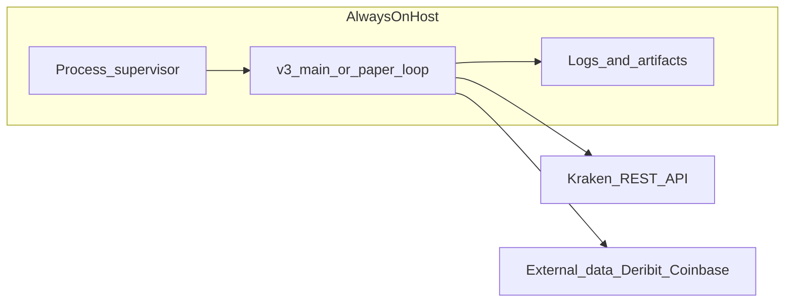

# Server-host plan (v3 trading loop)

## Purpose and scope

This document describes how to run the **MFT-cashcow v3** decision stack on an **always-on host** so trading logic does not depend on a laptop being awake. It is a **practical near-term** guide. For a broader AWS-centric, self-healing roadmap, see [planning/deployment-plan.md](planning/deployment-plan.md).

**In scope for this repo today:**

- Hourly (or few-minute) **paper / validate-safe** cycles, not high-frequency market making.
- **Kraken** as the execution venue (see [v3/config.yaml](../v3/config.yaml)).
- Process supervision, secrets, logging, and a phased path toward small live size.

**Out of scope here:** Terraform, Kubernetes, full CI/CD, or duplicating the self-healing ML loop spec in `deployment-plan.md`.

---

## How the codebase fits together

The hosted process is the same code you run locally:

| Piece | Role |
|-------|------|
| [v3/src/server/paper_runtime.py](../v3/src/server/paper_runtime.py) | `IntegratedPaperRuntime`: refresh candles, train/calibrate model, build trend runtime state, publish signals, drive decisions. |
| [v3/src/server/decision_engine.py](../v3/src/server/decision_engine.py) | Fuses regime, edge, and market-state into `TradeDecision` (buy/sell/hold/close). |
| [v3/src/execution/kraken_gateway.py](../v3/src/execution/kraken_gateway.py) | Maps decisions to Kraken preview/validate payloads. |
| [v3/main.py](../v3/main.py) | `--mode paper-once` runs one cycle. |
| [v3/scripts/run_paper_loop.py](../v3/scripts/run_paper_loop.py) | Continuous loop (interval from config). |

External data used by the hybrid path includes **Deribit funding** and **Coinbase premium** overlays (cached under `v3/data/`), aligned to the same feature frames as the Kraken OHLCV base.



---

## Strategy policy: `aggressive_v2_trend` vs guardrail profiles

**Naming:** `aggressive_v2_trend` is a **profile label** inside the v3 return-max walk-forward harness ([v3/scripts/run_walkforward_return_max.py](../v3/scripts/run_walkforward_return_max.py)). It is **not** a separate “v2 application” competing with v3. It means: **trend parameters ported from aggressive v2 research**, evaluated **inside** the v3 stack (overlays, walk-forward, same data pipeline).

**Production policy (tradeoff):**

- **Research champion** (`1x`): often `aggressive_v2_trend` for raw monthly return in backtests.
- **Guardrail profiles** (`aggressive_v2_trend_balanced`, `aggressive_v2_trend_balanced_top2`, etc.): lower drawdown or cap-friendly behavior under `2x`.

**Current defaults** in [v3/config.yaml](../v3/config.yaml) under `paper:`:

- `preferred_profile_1x` / `preferred_profile_2x` point at **balanced / balanced_top2** style profiles.
- `trend_profile: auto` resolves from [v3/data/walkforward/return_max_walkforward_summary.json](../v3/data/walkforward/return_max_walkforward_summary.json) with **drawdown guardrails** (`enforce_drawdown_guardrail`, `drawdown_cap_1x`, `drawdown_cap_2x`).

**To pin `aggressive_v2_trend` explicitly:** set `paper.trend_profile: aggressive_v2_trend` (and understand you may bypass the auto winner/guardrail logic). Re-run the walk-forward script after research changes so `return_max_walkforward_summary.json` stays consistent with what you deploy.

**Pair selection:** Profiles with `pair_selection` (e.g. `top2_trend_strength`) restrict active pairs in paper runtime; lookback is configurable via `paper.pair_selection_lookback_bars` (default: 120 days of hourly bars in code).

---

## How individual quant traders usually host this

Solo operators rarely rely on a sleeping laptop for live or continuous paper trading. Common patterns:

1. **Small Linux VPS** (1 vCPU, 1–2 GB RAM is often enough for hourly bar logic) in a region you trust.
2. **Process supervisor:** `systemd` service, or **Docker** with a restart policy—not manual `ssh` and `nohup` only.
3. **Secrets:** API keys in **environment variables** or a host secrets manager; **never** committed to git.
4. **Logs:** Rotate logs; persist artifacts (e.g. `v3/data/paper/`) to a known path or ship to object storage.
5. **Alerts:** Email, Slack, or Telegram on failure or on each trade (your choice).
6. **Kill switch:** Exchange-side **cancel-all-after** / dead-man patterns (see Kraken docs and [planning/deployment-plan.md](planning/deployment-plan.md) for conceptual alignment). This repo’s [`kraken` section in v3/config.yaml](../v3/config.yaml) includes `dead_man_timeout_sec`.

**“Big tech” cloud is optional.** AWS Lightsail, GCP Compute Engine (small VM), DigitalOcean, Hetzner, etc. are all common. **Reliability, cost, and your ops comfort** matter more than brand. For **1h bars**, latency to the exchange is usually **secondary** to uptime and correct scheduling.

---

## Hosting options (comparison)

| Option | Pros | Cons |
|--------|------|------|
| **Home PC + always on** | No VPS cost | Power/network outages, dynamic IP, security exposure |
| **Home PC + UPS** | Short blackout ride-through | Still not data-center reliability |
| **Managed VPS** | Simple, fixed IP, predictable cost (~$5–30/mo typical) | You manage OS updates and SSH keys |
| **Container on cloud** | Reproducible deploy | Same VPS concerns + image maintenance |

**Recommendation for this project:** a **small Linux VPS** + **systemd** (or Docker) running the v3 loop, after **paper-only** validation on that same host.

---

## Minimal production checklist

1. **OS:** Recent Ubuntu or Debian LTS; create a **non-root** deploy user.
2. **Firewall:** Allow SSH (key-only) and outbound HTTPS; deny unnecessary inbound ports.
3. **Dependencies:** Python 3.11+ (or repo `.venv`), repo checkout, `pip install` from project requirements.
4. **Secrets:** Export `KRAKEN_API_KEY` and `KRAKEN_API_SECRET` as referenced in [v3/config.yaml](../v3/config.yaml) (`kraken.api_key_env`, `kraken.api_secret_env`).
5. **Config:** Copy or symlink `v3/config.yaml`; ensure `execution.validate_orders` matches your phase (validate-only vs live).
6. **Scheduler:** Either:
   - `systemd` timer or service invoking `python3 v3/main.py --mode paper-once` on an interval, or
   - `python3 v3/scripts/run_paper_loop.py` with `paper.loop_interval_sec` set appropriately.
7. **Working directory:** Run from repo root so paths like `v3/data/` resolve.
8. **Health:** Cron or systemd `OnFailure` to alert if the process exits; optional HTTP health check if you add a small wrapper later.
9. **Backups:** Periodically copy `v3/data/paper/` artifacts and walk-forward JSONs off the box.

---

## Phased rollout

1. **Paper / validate on the server:** Same code path as local; confirms networking, credentials, and scheduling.
2. **Small live size:** Lower `execution.base_size_fraction`, keep `validate_orders: true` until you deliberately switch to live placement per your risk policy.
3. **Monitor:** Compare server artifacts to expectations (timestamps, hold reasons, no duplicate cycles if `skip_if_same_candle` is on).

---

## Risk and compliance

- This repository is **research software**, not a production trading product guarantee.
- **Kraken** terms, jurisdiction, and API limits apply to you; verify eligibility for margin or shorts if you enable them.
- Distinguish **order preview/validate** from **live** execution in your operational runbook.
- Past walk-forward results do not guarantee future returns.

---

## Relation to other docs

- **[planning/deployment-plan.md](planning/deployment-plan.md)** — Longer-term vision (AWS, self-healing retraining, drift detection). Use it when you want to invest in automation beyond “always-on VPS + loop.”
- **[v3/README.md](../v3/README.md)** — Day-to-day commands and module map.
- **[planning/3-31-2026-v3-active-work-checklist.md](planning/3-31-2026-v3-active-work-checklist.md)** — Research and evaluation backlog.

---

## Quick reference commands (on the server)

```bash
# One-shot paper cycle
python3 v3/main.py --mode paper-once

# Continuous paper loop (see v3/config.yaml paper.loop_interval_sec)
python3 v3/scripts/run_paper_loop.py --iterations 0

# Bounded smoke test: env check + three successful cycles + artifact checks
python3 v3/scripts/smoke_paper_deploy.py
```

Ensure the virtualenv matches production (e.g. `source .venv/bin/activate`) and that `v2` data paths in config resolve correctly on the host.

---

## VPS bootstrap (step-by-step)

The fastest path from "empty VPS" to "paper loop running":

1. **Provision a VPS** — 1 vCPU, 1 GB RAM, Ubuntu 24.04 LTS, ~$4–6/mo (Hetzner, DigitalOcean, Linode, Lightsail, etc.).
2. **SSH in as root** and run the automated bootstrap:
   ```bash
   git clone https://github.com/sunnycho100/MFT-cashcow.git /opt/mft-cashcow
   bash /opt/mft-cashcow/deploy/scripts/vps-setup.sh
   ```
3. **Add your SSH key** to `/home/mft/.ssh/authorized_keys`.
4. **Fill in API keys** — `sudo nano /etc/mft-cashcow.env`.
5. **Smoke test** — run as the `mft` user, confirm three cycles pass.
6. **Enable systemd** — `sudo systemctl enable --now mft-cashcow-paper.service`.

The setup script handles: deploy user, SSH hardening, UFW, Python 3.11, TA-Lib, virtualenv, systemd unit, log rotation. Full details and Docker alternative in **[deploy/README.md §7](../deploy/README.md)**.

---

## Deploy artifacts in this repo

| File | Purpose |
|------|---------|
| `deploy/scripts/vps-setup.sh` | Automated VPS bootstrap script |
| `deploy/Dockerfile` | Container image for the paper loop |
| `deploy/docker-compose.yml` | Compose file (bind-mount data, env from `.env`) |
| `deploy/env.example` | Template for secrets |
| `deploy/systemd/mft-cashcow-paper.service` | systemd unit for direct host deployment |

For copy-paste install steps, see **[deploy/README.md](../deploy/README.md)**.
